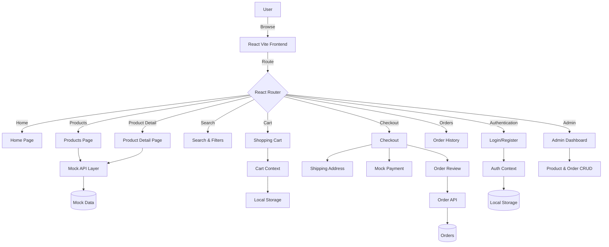

# 🛒 E-Commerce Web Application

> A modern, responsive, full-stack ready e-commerce web application built with **React + Vite + TypeScript**. The project demonstrates a scalable architecture with authentication, shopping cart, checkout flow, order management, and an admin dashboard using a mock API layer.


---

# 📖 Overview

This project is a feature-rich e-commerce platform that simulates the workflow of a real online shopping application.

It provides:

- Product browsing
- Product search & filtering
- Shopping cart management
- User authentication
- Checkout process
- Order tracking
- Admin dashboard
- Mock API integration
- Persistent cart using Local Storage

The architecture is intentionally modular so that the mock APIs can later be replaced with real backend services such as Node.js, Express, Django, Spring Boot, or .NET.

---

# ✨ Features

## 👤 User Features

- User Registration
- User Login
- JWT Authentication (Mock)
- Product Listing
- Product Details
- Product Search
- Product Filtering
- Add to Cart
- Remove from Cart
- Update Quantity
- Persistent Cart
- Checkout Workflow
- Shipping Address
- Payment Simulation
- Order Review
- Order History
- Order Tracking

---

## 🛠 Admin Features

- Dashboard
- Manage Products
- Add Products
- Edit Products
- Delete Products
- View Orders
- Manage Orders

---

## 💻 Technical Features

- React + Vite
- TypeScript
- React Router
- Context API
- Modular Architecture
- Local Storage Persistence
- Mock REST APIs
- Reusable UI Components
- Responsive Design

---

# 🏗 Architecture

```
User
   │
   ▼
React Frontend
   │
React Router
   │
Pages
   │
Services (Mock APIs)
   │
Mock Data
```

---

# 🔄 Application Workflow



---

# 📂 Project Structure

```
src/
│
├── app/
│   └── App.tsx
│
├── components/
│   ├── Navbar/
│   ├── Footer/
│   ├── ProductCard/
│   ├── SearchBar/
│   ├── Filters/
│   └── UI/
│
├── contexts/
│   ├── AuthContext.tsx
│   └── CartContext.tsx
│
├── pages/
│   ├── Home.tsx
│   ├── Products.tsx
│   ├── ProductDetail.tsx
│   ├── Cart.tsx
│   ├── Checkout.tsx
│   ├── Orders.tsx
│   ├── Login.tsx
│   ├── Register.tsx
│   └── Admin.tsx
│
├── services/
│   └── api.ts
│
├── data/
│   └── mockData.ts
│
├── types/
│   └── index.ts
│
└── main.tsx
```

---

# 🧩 Core Modules

| Module | Responsibility |
|---------|----------------|
| React Router | Application Navigation |
| Auth Context | Authentication Management |
| Cart Context | Shopping Cart State |
| Mock API | Simulated Backend |
| Mock Data | Product & Order Data |
| Components | Reusable UI |
| Pages | Application Screens |

---

# ⚙ State Management

### Authentication

- Login
- Register
- JWT (Mock)
- User Session
- Local Storage

### Cart

- Add Product
- Remove Product
- Update Quantity
- Calculate Total
- Persist Cart

---

# 💾 Data Flow

```
User Action
      │
      ▼
React Component
      │
      ▼
Context API
      │
      ▼
Mock API
      │
      ▼
Mock Data
      │
      ▼
UI Update
```

---

# 💳 Checkout Flow

```
Cart
   │
   ▼
Shipping Address
   │
   ▼
Payment Simulation
   │
   ▼
Order Review
   │
   ▼
Create Order
   │
   ▼
Order Confirmation
```

---

# 🔐 Authentication Flow

```
Login/Register
      │
      ▼
Mock Authentication
      │
      ▼
Generate JWT
      │
      ▼
Store in Local Storage
      │
      ▼
Protected Routes
```

---

# 🚀 Getting Started

## Clone Repository

```bash
git clone https://github.com/yourusername/ecommerce-app.git
```

---

## Install Dependencies

```bash
npm install
```

---

## Start Development Server

```bash
npm run dev
```

---

## Build Project

```bash
npm run build
```

---

## Preview Production Build

```bash
npm run preview
```

---

# 🛠 Tech Stack

| Technology | Purpose |
|------------|----------|
| React | UI Development |
| Vite | Build Tool |
| TypeScript | Type Safety |
| React Router | Routing |
| Context API | State Management |
| Local Storage | Persistence |
| Mock API | Backend Simulation |

---

# 📈 Future Improvements

- Node.js + Express Backend
- MongoDB / PostgreSQL
- Stripe Payment Gateway
- Razorpay Integration
- JWT Authentication
- OAuth Login
- Wishlist
- Product Reviews
- Coupons & Discounts
- Email Notifications
- Inventory Management
- Admin Analytics
- Image Upload
- Search Suggestions
- Real-time Order Tracking
- Docker Deployment
- CI/CD Pipeline
- Unit Testing
- Integration Testing

---

# 📷 Screenshots

> Add screenshots of your application here.

```
Home Page

Products Page

Product Detail

Cart

Checkout

Admin Dashboard
```

---

# 🤝 Contributing

Contributions are welcome!

1. Fork the repository
2. Create your feature branch

```bash
git checkout -b feature/NewFeature
```

3. Commit your changes

```bash
git commit -m "Add new feature"
```

4. Push the branch

```bash
git push origin feature/NewFeature
```

5. Open a Pull Request

---

# 📄 License

This project is licensed under the **MIT License**.

---

# 👨‍💻 Author

**Surya Snata Panigrahi**

- Frontend Developer
- Full Stack Developer
- Data Analytics Enthusiast

---

⭐ If you found this project useful, don't forget to **Star** the repository!
